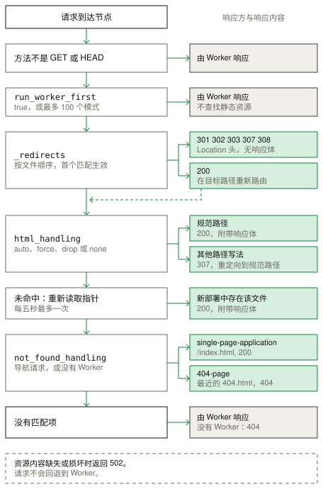

# 静态资源

静态资源用于提供目录中的文件，可以配合 Worker，也可以单独使用。`celld deploy` 会随部署一起将目录上传到集群存储桶；节点首次提供某个文件时，会将其缓存到本地磁盘。标准行为请参阅 [Cloudflare Static Assets 文档](https://developers.cloudflare.com/workers/static-assets/)。

## 示例

[静态资源示例](../../examples/static-assets) 不使用 Worker，直接提供 `public` 目录中的 HTML 文件。`_headers` 文件添加响应头，`_redirects` 文件将 `/home` 重定向到 `/`。

<!-- celld-example: static-assets -->

## API

`assets` 配置块设置目录与路由：

- `directory` 指定要上传的目录。
- `binding` 向 Worker 暴露 `env.ASSETS.fetch()`。
- `html_handling` 将路径映射到 HTML 文件。
- `not_found_handling` 选择 `single-page-application` 或 `404-page`。
- `run_worker_first` 将匹配的请求优先发送到 Worker。
- 目录中的 `_headers` 和 `_redirects` 文件分别设置响应头与重定向。

## 部署

`assets` 配置块接受 `directory`、`binding`、`html_handling`、`not_found_handling` 和 `run_worker_first`。其他字段会停止部署。包含 `assets` 但没有 `main` 的项目不能设置 `run_worker_first`，也不能声明绑定。

`celld deploy` 按 SHA-256 摘要存储每个文件的内容，同一内容只存一次，重新部署只上传变化的内容。与 Wrangler 一样，扩展名未知的文件不会获得 `Content-Type` 头。

## 路由

celld 只对 `GET` 或 `HEAD` 请求查找资源，其他方法都会交给 Worker。`run_worker_first` 接受 `true`，或最多 100 个路由模式组成的列表；模式前缀 `!` 表示排除路径。匹配的请求优先交给 Worker。精确模式 `/` 只匹配根路径。

`_redirects` 规则在查找任何文件之前执行，首个匹配项生效。状态为 301、302、303、307 或 308 的规则返回带 `Location` 头的响应。状态为 200 的规则会在本地目标路径重新进行路由，同时保留原始 URL。

`html_handling` 默认为 `auto-trailing-slash`，将 `/about` 映射到 `/about.html`，将 `/about/` 映射到 `/about/index.html`。其他模式为 `force-trailing-slash`、`drop-trailing-slash` 和 `none`。非规范路径会收到 `307`，重定向到规范路径并保留查询字符串。

未命中后，节点会重新读取部署指针，每五秒最多一次。在滚动重启期间，较新的索引因此可以提供升级后节点引用的文件。

`not_found_handling` 设为 `single-page-application` 时，以状态 200 返回 `/index.html`；设为 `404-page` 时，以状态 404 返回最近的 `404.html`。存在 Worker 时，celld 仅对导航请求应用该设置，其他未命中请求由 Worker 响应。没有 Worker 且没有匹配项时，节点返回 `404`。集群存储桶无法提供文件内容时会返回 `502`，不会转交给 Worker。

## 响应

磁盘缓存默认容量为 512 MiB，可以通过 `CELLD_ASSET_CACHE_BYTES` 修改。缓存采用最近最少使用策略逐出文件。

`ETag` 是文件内容的强 SHA-256 摘要，因此匹配的 `If-None-Match` 会得到 `304`。`Range` 头会得到 `206`，无法满足的范围会得到 `416`，`HEAD` 响应保留真实的 `Content-Length`。普通响应带有 `Cache-Control: public, max-age=0, must-revalidate`。对于文件名包含内容哈希的文件，可以通过 `_headers` 规则设置较长的 `Cache-Control`。

`binding` 暴露 `env.ASSETS.fetch()`，接受 `Request`、`URL` 或字符串。方法不是 `GET` 或 `HEAD` 时返回 `405`，并且始终应用 `not_found_handling`。

## 与 Cloudflare 的差异

- celld 不压缩静态资源响应。客户端需要 gzip 或 brotli 时，应使用提供压缩的入口代理。
- celld 没有边缘缓存。每个节点维护 512 MiB 磁盘缓存，可通过 `CELLD_ASSET_CACHE_BYTES` 配置，并要求浏览器重新验证缓存。
- 静态资源未命中后，节点每五秒最多检查一次部署指针。
- celld 读取 `If-None-Match` 和 `If-Range`，不发送 `Last-Modified`，也不读取 `If-Modified-Since`。
- `_headers` 文件不能更改 `connection`、`content-length` 或 `transfer-encoding`。
- 一次部署最多包含 20,000 个资源，总大小最多 1 GiB。单个文件最多 25 MiB。`CELLD_MAX_ASSET_FILE_BYTES` 可以修改单文件上限，但部署构建器、托管部署代理和服务节点必须使用相同值。进程只读取一次该值，因此修改后需要重启。文件过大的错误会报告路径、大小和上限。每个 `_headers` 或 `_redirects` 文件最多 100 KiB。
- `celld deploy` 的 `assets` 块只接受 `directory`、`binding`、`html_handling`、`not_found_handling` 和 `run_worker_first`。
- `celld deploy` 遇到 `.assetsignore` 会拒绝并停止部署，而不是忽略该文件。它也会拒绝符号链接、特殊文件、非 UTF-8 文件名、解码后不安全的路径，以及 `_worker.js` 条目。
- 静态资源绑定只有 `fetch()` 一个方法，celld 不提供 `unstable_` 辅助方法。

[Cloudflare 兼容性](../cloudflare-compat.md#services)页面列出了运行时 API 和不支持的服务。
