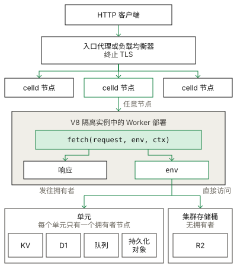

# Workers

Worker 是使用 [Cloudflare Workers API](https://developers.cloudflare.com/workers/runtime-apis/) 的无状态请求处理程序。celld 在集群的每个节点上，通过 V8 隔离实例（isolate）运行部署的代码。

## 示例

[hello 示例](../../examples/hello) 从 `fetch` 处理函数返回文本响应。

<!-- celld-example: hello -->

## API

- `fetch(request, env, ctx)` 是默认导出对象的处理方法。它接收传入的 `Request`，并返回 `Response`。
- `scheduled` 处理定时触发器，`queue` 处理 Queues 消费者事件。
- `env` 包含 Wrangler 配置中声明的绑定。
- `ctx.waitUntil(promise)` 使隔离实例在响应发送给客户端后仍然存活，直到该 Promise 完成。

完整列表请参阅[处理函数文档](https://developers.cloudflare.com/workers/runtime-apis/handlers/)。

## 请求路径

celld 提供明文 HTTP 服务，因此需要由入口代理终止 TLS。由于每个节点都持有当前部署，负载均衡器可以将请求发送到任意节点。接收请求的节点运行处理函数，并将绑定调用转发到拥有相应单元的节点。R2 绑定则直接读写集群存储桶。

与 workerd 一样，主模块的每个导出都必须是处理函数对象或类；主模块如果导出字符串或数字，将无法启动。

celld 在一个隔离实例中运行多个请求，也可能随时销毁隔离实例，因此 Worker 必须通过绑定保存状态，不能将状态保存在模块作用域中。

## 与 Cloudflare 的差异

- celld 不管理自定义域名，也不终止 TLS。
- `ctx.passThroughOnException()` 不起作用，因为 celld 没有 CDN。
- celld 不提供 Workers AI 绑定。进程会拒绝 `CELLD_AI_BINDING` 和 `CELLD_AI_URL`，部署会拒绝 `ai` 声明。

[Cloudflare 兼容性](../cloudflare-compat.md#services)页面列出了运行时 API 和不支持的服务。

## Python Workers

`main` 指向 `.py` 文件的 Worker 使用 [Cloudflare Python Workers](https://developers.cloudflare.com/workers/languages/python/) API。同一个项目无需修改即可在 Cloudflare 上运行。celld 支持该平台的一部分功能，本节列出了支持范围。

[Python 示例](../../examples/python) 使用 SDK 和打包到项目中的第三方依赖处理请求。

<!-- celld-example: python -->

### 构建项目

运行 `uv run pywrangler sync` 将依赖包复制到 `python_modules/`，然后运行 `celld dev .`。构建会拒绝不完整的 Workers SDK（`workers-runtime-sdk`）。

`celld deploy` 打包 Pyodide 运行时、`python_modules/`，以及 `main` 所在目录下符合 Wrangler 默认模块规则的文件：`.py`、`.txt`、`.html`、`.sql`、`.bin` 和 `.wasm`。与 Cloudflare 一样，Worker 可以在 `/session/metadata` 下打开这些文件。运行时不会下载任何文件。

首次构建会从 Pyodide CDN 下载 Pyodide 运行时，并检查每个文件的大小和 SHA-256。后续构建复用 `$XDG_CACHE_HOME/celld/pyodide-0.28.3`，或 `~/.cache/celld/pyodide-0.28.3`。设置 `CELLD_PYTHON_RUNTIME_DIR` 可以使用其他目录；如果该目录已包含所需文件，构建即可离线进行。下载连续 60 秒未收到数据时会失败。构建需要在 `PATH` 中找到 `esbuild`，或者通过 `CELLD_ESBUILD` 指定其路径。

Python 部署需要 `python-workers-v1` 特性，而 `celld deploy` 不会检查节点是否支持它。缺少该特性的运行中节点会记录错误，并继续使用当前部署，导致集群同时提供两个版本的服务。如果当前部署包含 Python，缺少该特性的节点在启动时会报错退出。首次部署 Python 前必须升级所有节点；当前部署仍包含 Python 时，不要降级。

### 运行时版本

celld 运行 Pyodide 0.28.3，使用 CPython 3.13.2 和 `pyodide_2025_0` wheel ABI。Cloudflare 通过 `python_workers_20250116` 选择这一版本系列（其运行时为带有自身补丁的 Pyodide 0.28.2）。配置必须满足：

- `compatibility_flags` 包含 `python_workers`。
- `compatibility_date` 格式为 `YYYY-MM-DD`。
- `compatibility_date` 为 2026-04-21 或更晚。使用更早的日期时，必须通过标志启用该日期尚未默认启用的各项行为：2025-08-11 之前需要 `python_workers_force_new_vendor_path`，2025-08-14 之前需要 `python_no_global_handlers`，2025-09-29 之前需要 `python_workers_20250116`，2026-04-21 之前需要 `enable_python_external_sdk`。
- `compatibility_date` 早于 2026-09-08，或者标志包含 `no_python_workers_314`。从 2026-09-08 起，Cloudflare 运行 Pyodide 314（Python 3.14），需要使用另一个 ABI 的 wheel 包。

celld 在部署时拒绝其他配置组合。`python_process_pth_files` 遵循其兼容性日期（2026-05-26）。

### 支持的功能

| API | 说明 |
| --- | --- |
| `Default(WorkerEntrypoint).fetch` | 每个请求创建一个实例，与 Cloudflare 一致 |
| `workers.Response`、`Response.json`、请求体、文本和头部 | 已在测试中与 workerd 对照验证 |
| `workers.fetch` | 发起出站 HTTP 请求 |
| `self.env` 绑定 | 已测试 KV。其他绑定与 JavaScript Worker 获得的对象相同，但尚未在 Python 中测试 |
| `self.ctx.waitUntil` | 保持 Python 可等待对象存活，直到其完成 |
| `python_modules/` 中的纯 Python 包 | 已测试 `beautifulsoup4` |
| `from js import ...` | 访问隔离实例中的 JavaScript 全局对象 |

### 不支持的功能

- 用 Python 编写的 Durable Objects、Workflows、定时触发器和 Queue 消费者。`celld deploy` 会拒绝声明这些功能的 Python 项目。
- 具名入口点类，以及对 Python 方法的 RPC 调用。
- 包含编译扩展（`.so` 文件）的依赖包，以及 Pyodide 以独立包提供的标准库模块：`ssl`、`sqlite3`、`lzma` 和依赖 OpenSSL 的 `hashlib` 算法。
- `pyodide.ffi.run_sync`，以及针对 `cloudflare:workers` 和 `cloudflare:sockets` 以外模块的 `workers.import_from_javascript`。celld 隐藏 WebAssembly 栈切换（JSPI），因为在 JSPI 下，每次异步入口调用都会泄漏 C 栈空间，直到解释器停止。
- Python Worker 中的 `process.exit()` 会抛出错误。
- 内存快照和 `_cloudflare` 包的导入补丁。依赖这些能力的包补丁，例如同步 FastAPI 处理函数所需的补丁，不会生效。

### 失败时的行为

解释器在隔离实例收到第一个请求时启动，多个并发的首次请求会共享这次启动过程。如果主模块抛出错误，该隔离实例收到的所有请求都会以相同的堆栈回溯失败。

解释器发生致命错误，例如 C 栈溢出时，隔离实例中正在运行的所有请求都会失败。celld 随后会像 Cloudflare 一样替换隔离实例，因此下一个请求可能需要等待新解释器启动。
